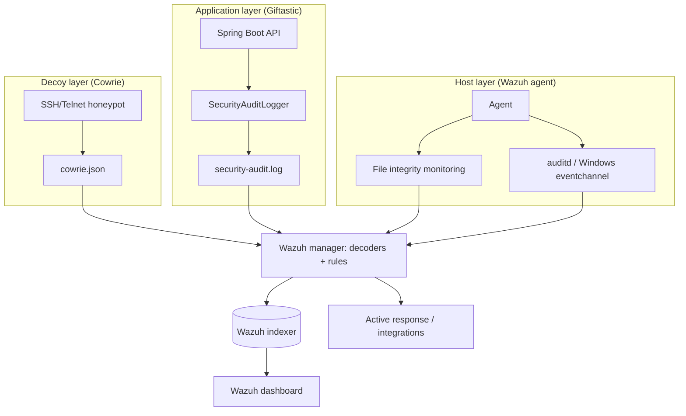

# Architecture

This document describes the monitoring architecture, the data flow from
Giftastic and Cowrie into Wazuh, and the trust boundaries of the lab.

## Goals

1. Capture security-relevant events that the application already knows about
   (authentication, authorization, abuse controls) without changing the request
   contract or logging sensitive payloads.
2. Add host-level and file-integrity signals so application events can be
   correlated with changes on the machine running the service.
3. Provide a decoy service whose only purpose is to attract and record attacker
   behavior, so intrusion attempts are observable without risking real systems.
4. Keep the design safe to demonstrate: no production services are exposed and
   no customer or credential data is collected from the real platform.

## Defense-in-depth layers



Each layer answers a different question:

- **Application layer** - Who authenticated? Who was denied? Was an abuse
  control triggered? This is where authorization-bypass and financial-tampering
  attempts surface.
- **Host layer** - Did files change? Did an account change? Did privileged
  commands run? This is how application-layer findings gain host context.
- **Decoy layer** - What do attackers try when they reach a plausible target?
  Credentials, commands, tooling, and source IPs.

## Data flow

### Giftastic application events

1. `SecurityAuditLogger` (in `common/security`) emits one JSON object per event
   to the dedicated `SECURITY_AUDIT` SLF4J logger.
2. `logback-spring.xml` routes that logger to
   `logs/security-audit.log` with a rolling policy, bypassing the console
   appender (`additivity=false`).
3. A Wazuh agent tails the file with `<log_format>json</log_format>`, or - in the
   single-host demo - the manager reads a bind-mounted copy directly.
4. The built-in `json` decoder extracts each key as a dynamic field.
5. `giftastic_rules.xml` matches on `event_type`, `subject`, `source_ip`,
   `path`, and `reason`, and correlation rules use `same_field` to group
   repeated activity.

The event schema is deliberately small and non-sensitive:

```json
{
  "@timestamp": "2026-10-02T12:00:00.000Z",
  "event_id": "8f1c...",
  "event_type": "auth.login.failure",
  "outcome": "failure",
  "subject": "customer@example.com",
  "source_ip": "203.0.113.10",
  "method": "POST",
  "path": "/api/v1/auth/login",
  "reason": "BadCredentialsException"
}
```

No passwords, tokens, request bodies, or payment data are written.

### Cowrie honeypot events

1. Cowrie runs with the JSON output plugin and writes `cowrie.json`.
2. The manager ingests it as JSON.
3. `cowrie_rules.xml` matches on `eventid`, `src_ip`, `username`, `password`,
   and `input`.

Cowrie event IDs used by the rules: `cowrie.session.connect`,
`cowrie.login.failed`, `cowrie.login.success`, `cowrie.command.input`,
`cowrie.session.file_download`, `cowrie.session.closed`.

### Host / file integrity

The agent configuration enables:

- `syscheck` (FIM) with real-time monitoring of the deployed application path and
  the systemd unit directory (Linux) or the application directory (Windows).
- `auditd` on Linux, and the Security/Application event channels on Windows.
- `rootcheck` and SCA for baseline configuration assessment.

## Trust boundaries

| Boundary | Control |
| --- | --- |
| Public internet -> dashboard/API | Lab only, TLS with self-signed certs, change default passwords, never expose |
| Giftastic -> audit file | Structured, allow-listed fields; no secrets or PII beyond the account identifier |
| Agent -> manager | Encrypted agent channel (AES), port 1514/tcp |
| Manager -> indexer | Mutual TLS using generated certificates |
| Manager -> manager (cluster) | Disabled in this single-node lab |
| Honeypot -> host | Cowrie runs with `cap_drop: ALL` and `no-new-privileges`; it is a decoy and must never share credentials with real systems |

## Deployment topologies

### Single-host demo (this repository)

Wazuh stack and Cowrie run in Docker on one host; the Giftastic audit log is
bind-mounted into the manager. Fast to start and ideal for a defense demo, but
it collapses the host boundary.

### Production-like (recommended mental model)

- Wazuh manager, indexer, and dashboard run on dedicated monitoring hosts.
- Each Giftastic backend host runs a Wazuh agent that forwards only the audit
  log and FIM data.
- Cowrie runs on a separate, network-segmented decoy host reached only by the
  honeypot VLAN/port-forward, with its own agent.
- The manager's `localfile` blocks for `external/` are removed; all telemetry
  arrives through agents.

The rules and decoders are identical in both topologies.

## Why these tools

- **Wazuh** provides the SIEM/XDR functions the project needs: log collection,
  JSON decoding, rule correlation, FIM, vulnerability detection, and alerting,
  with an open licence and a single-node deployment path.
- **Cowrie** is a mature, low-interaction SSH/Telnet honeypot that records
  credentials and shell interaction in JSON, which maps cleanly onto Wazuh's
  JSON decoder.

See [residual-risk.md](residual-risk.md) for the limits of this design.
